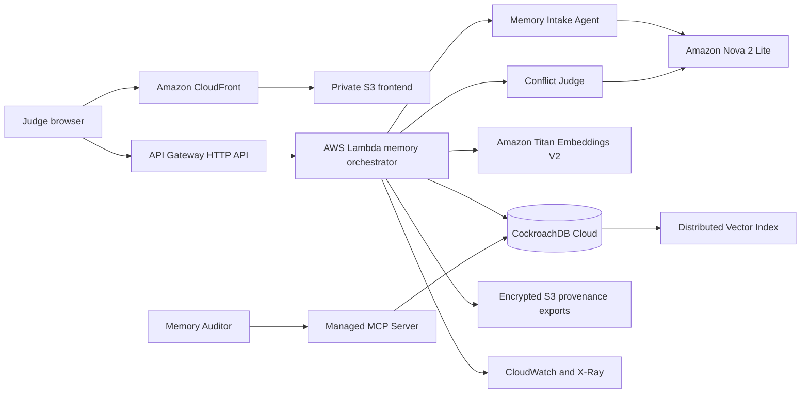

# Architecture

## Architectural thesis

Persistent identity is a versioned authority graph over memory.

The system separates five operations that ordinary chat history collapses:

1. receiving language;
2. extracting an atomic claim;
3. locating semantically related authority;
4. deciding whether the claims can coexist;
5. changing the canonical projection through an attributable resolution.

## System diagram



## Write path

```text
POST claim
  → validate request
  → verify identity
  → extract one structured claim
  → create 512-dimensional embedding
  → retrieve up to eight active semantic neighbours
  → assess every neighbour for incompatibility
  → begin serializable transaction
      → persist source
      → persist incoming claim
      → when conflict exists:
           status = candidate
           create conflict case and links
           append CONFLICT_OPENED event
           preserve current canonical snapshot
      → otherwise:
           status = active
           create next canonical snapshot
           copy active claim membership
           append CLAIM_COMMITTED event
  → commit
```

## Resolution path

```text
POST conflict resolution
  → lock the conflict case
  → reject repeated resolution
  → apply decision
      accept_incoming: existing active claims become superseded
      keep_existing: incoming candidate becomes rejected
      coexist: incoming candidate becomes active beside established claims
  → create next canonical snapshot
  → store resolution and rationale
  → append CONFLICT_RESOLVED event
  → commit
```

## Read path

Context restoration does not scan chat messages and infer the latest truth.

It reads:

```text
identity.current_version
  → canonical_snapshots(version_no)
  → canonical_snapshot_claims
  → exact claims authoritative in that version
```

This gives deterministic later-session restoration.

## CockroachDB transaction strategy

The repository uses CockroachDB serializable transactions. Mutating operations retry SQLSTATE `40001` up to four times with exponential delay.

Identity rows are locked while a version is allocated. The unique constraint on `(identity_id, version_no)` prevents duplicate versions. Conflict resolution locks the conflict case and permits one resolution row through a unique foreign key.

## Vector strategy

Every structured claim receives an Amazon Titan embedding with 512 dimensions.

```sql
embedding VECTOR(512)
```

The index is identity-scoped and cosine-optimized:

```sql
CREATE VECTOR INDEX memory_claim_embedding_idx
ON memory_claims (identity_id, embedding vector_cosine_ops);
```

Retrieval requires the prefix filter:

```sql
WHERE identity_id = $1
  AND status = 'active'
ORDER BY embedding <=> $2::VECTOR
LIMIT 8
```

The selected value is exposed as cosine similarity through `1 - cosine_distance`.

## Agent boundaries

Memory Intake Agent

- receives untrusted language as data;
- extracts one atomic claim;
- assigns a memory type and confidence;
- returns strict JSON validated by Zod.

Conflict Judge

- receives only the incoming structured claim and retrieved candidates;
- classifies direct negation, identity collision, status replacement, temporal update, scope collision or uncertainty;
- recommends accept, retain or coexist;
- cannot create candidate IDs;
- does not apply the final decision.

Memory Auditor

- connects through Managed MCP;
- checks schema, index, open cases, resolution integrity and canonical projection;
- produces audit evidence;
- does not mutate memory.

Human owner

- establishes identity;
- supplies sources;
- decides conflict resolution;
- provides rationale;
- controls account publication and legal submission.

## Repository abstraction

`MemoryRepository` defines the persistence contract.

Production uses `CockroachMemoryRepository`.

Tests use `InMemoryRepository`.

This separation lets domain invariants run locally without imitating CockroachDB SQL, while production keeps atomic writes and distributed vector search in CockroachDB.

## Failure model

Model extraction failure

- `bedrock` mode returns an error;
- `hybrid` mode uses deterministic extraction.

Embedding failure

- `bedrock` mode returns an error;
- `hybrid` mode generates a normalized deterministic vector of the same dimension.

Conflict model failure

- `hybrid` mode runs lexical same-subject and same-predicate comparison.

Serializable conflict

- database operation retries SQLSTATE `40001`.

Invalid model structure

- Zod rejects output before persistence.

Repeated human resolution

- conflict case lock and unique resolution reject the second write.

Frontend interruption

- committed database state remains authoritative and is restored through the context endpoint.
